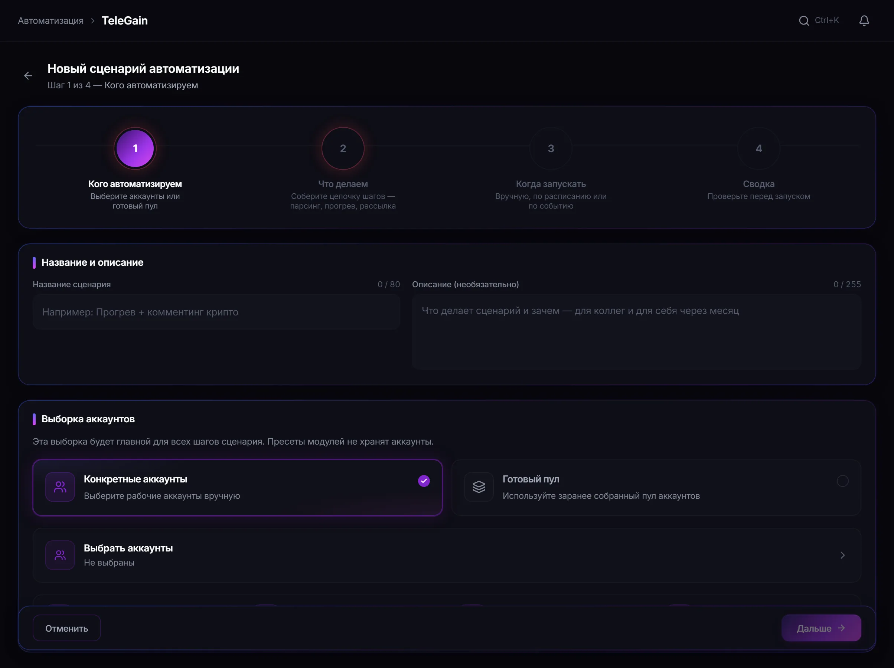

# Автоматизация задач в TeleGain

Автоматизация сохраняет сценарий запуска и повторяет его по расписанию или условию, а вы наблюдаете за журналом вместо ручного старта каждый раз.

**[Полное руководство →](https://telegain-guides.github.io/modules/automation/)**  ·  **[Официальная страница модуля →](https://telegain.net/ru/modules/automation)**

---

## Кратко о модуле

| Параметр | Значение |
| --- | --- |
| Что нужно заранее | задача, которую вы уже запускали вручную |
| Условие срабатывания | расписание или заданное условие |
| Журнал | каждое срабатывание с результатом, а не только с фактом запуска |
| Ограничение | расписание не освобождает занятые аккаунты |

## Минимальный сценарий настройки

1. Выберите поддерживаемую задачу и её параметры.
2. Задайте условия и расписание запуска.
3. Проверьте конфигурацию до включения.
4. Включите сценарий и следите за журналом.

## Интерфейс модуля

## Ограничения и правила платформы

- Автоматизация повторяет сценарий, но не проверяет его разумность.
- Регулярность делает автоматизацию заметнее для платформы, чем разовый запуск.
- Разовые кампании с ручной проверкой автоматизировать обычно не стоит.

## Частые ошибки

| Ситуация | Что происходит |
| --- | --- |
| Запуск не состоялся | в момент срабатывания аккаунты были заняты |
| Ошибка повторяется регулярно | автоматизирован непроверенный сценарий |

## Связанные модули

- [Статистика](https://github.com/telegain-guides/telegain-statistics)
- [Прогрев аккаунтов](https://github.com/telegain-guides/telegram-account-warmup-telegain)

## Документация

- [Полное руководство по модулю](https://telegain-guides.github.io/modules/automation/)
- [Каталог всех модулей](https://telegain-guides.github.io/modules/)
- [Диагностика запусков](https://telegain-guides.github.io/troubleshooting/)
- [Ответственное использование](https://telegain-guides.github.io/responsible-use/)

---

TeleGain — независимый сервис. Он не принадлежит Telegram, не аффилирован с Telegram FZ-LLC
и не является официальным продуктом мессенджера. Telegram — товарный знак своего правообладателя.
